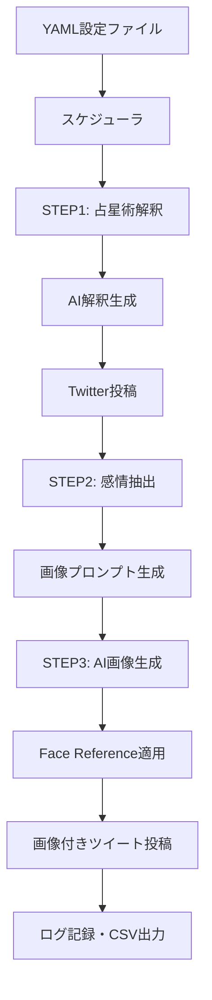

# 📐 TwitterBot_Nexus_02 基本仕様と仕様書作成ガイド

**最終更新**: 2025-11-23  
**統合バージョン**: 1.0

このドキュメントは、以下の4つのドキュメントを統合したものです：
- `specification.md` - TwitterBot_Nexus_02 完全構築ガイド・仕様書 (v2.0.0)
- `SPEC_OVERVIEW.md` - 全体仕様 (v1.0)
- `complete_specification_creation_guide_v1.0.md` - 完全な仕様書作成手順書 (v1.0)
- `complete_specification_creation_guide_v1.1.md` - 完全な仕様書作成手順書 (v1.1)

---

## 📋 目次

### Part A: TwitterBot_Nexus_02 プロジェクト仕様
1. [プロジェクト概要](#part-a-1-プロジェクト概要)
2. [システム全体構成](#part-a-2-システム全体構成)
3. [構築手順](#part-a-3-構築手順)
4. [運用・実行方法](#part-a-4-運用実行方法)
5. [テスト・品質保証](#part-a-5-テスト品質保証)
6. [セキュリティ・設定](#part-a-6-セキュリティ設定)
7. [トラブルシューティング](#part-a-7-トラブルシューティング)
8. [拡張・カスタマイズ](#part-a-8-拡張カスタマイズ)

### Part B: 全体仕様（マルチアカウント対応）
1. [目的と要件](#part-b-1-目的と要件)
2. [アーキテクチャ](#part-b-2-アーキテクチャ)
3. [設定ファイル構造](#part-b-3-設定ファイル構造)
4. [データベース](#part-b-4-データベース)
5. [モジュール構成](#part-b-5-モジュール構成)
6. [リスクと対策](#part-b-6-リスクと対策)

### Part C: 仕様書作成手順書 v1.0
1. [手順書の目的](#part-c-1-手順書の目的)
2. [Phase 1: 価値定義](#part-c-2-phase-1-価値定義)
3. [Phase 2: 技術基盤定義](#part-c-3-phase-2-技術基盤定義)
4. [Phase 3: 実装設計](#part-c-4-phase-3-実装設計)
5. [Phase 4: 品質保証設計](#part-c-5-phase-4-品質保証設計)
6. [Phase 5: 運用・発展設計](#part-c-6-phase-5-運用発展設計)
7. [Phase 6: 仕様書品質検証](#part-c-7-phase-6-仕様書品質検証)
8. [Phase 7: 継続改善](#part-c-8-phase-7-継続改善)

### Part D: 仕様書作成手順書 v1.1（改善版）
1. [前提知識・スキル要件](#part-d-1-前提知識スキル要件)
2. [実践的支援ツール](#part-d-2-実践的支援ツール)
3. [Phase 1: 価値定義（改善版）](#part-d-3-phase-1-価値定義改善版)
4. [Phase 2: 技術基盤定義（改善版）](#part-d-4-phase-2-技術基盤定義改善版)
5. [Phase 3: 要件分析（改善版）](#part-d-5-phase-3-要件分析改善版)
6. [Phase 4: 設計・実装（改善版）](#part-d-6-phase-4-設計実装改善版)
7. [Phase 5: 検証・品質保証（改善版)](#part-d-7-phase-5-検証品質保証改善版)
8. [Phase 6: 文書化・運用準備（改善版）](#part-d-8-phase-6-文書化運用準備改善版)
9. [Phase 7: リリース・展開（改善版）](#part-d-9-phase-7-リリース展開改善版)
10. [完成度評価ツール](#part-d-10-完成度評価ツール)

---

# Part A: TwitterBot_Nexus_02 プロジェクト仕様

## Part A-1: プロジェクト概要

### 目的
TwitterBot_Nexus_02は、AI技術を活用した高機能Twitterボットシステムです。占星術解釈、AI画像生成、テキスト処理、ブラウザ自動化を統合し、人間らしい自然な投稿を24時間自動で実現します。

### プロジェクト特徴
- **6つの主要機能**: Twitter自動投稿、AI占星術、AI画像生成、感情抽出、ブラウザ自動化、統合ワークフロー
- **企業レベル品質**: 100%テスト成功（26/26テスト）、Python 3.8+対応
- **独立ライブラリ**: pip installable パッケージとして他プロジェクトでも利用可能
- **AI統合**: Google Gemini、OpenAI DALL-E 3対応

---

## Part A-2: システム全体構成

### ディレクトリ構造
```
TwitterBot_Nexus_02/
├── reply_bot/              # メインボット機能
│   ├── multi_main.py       # 基本Twitter自動投稿システム
│   ├── schedule_tweet_main.py # スケジュール実行システム
│   ├── operate_latest_tweet.py # 新規ツイート応答システム
│   ├── greeting_tracker.py  # 挨拶追跡管理システム
│   ├── csv_generator.py     # CSV出力・分析システム
│   └── add_user_preferences.py # ユーザー設定拡張システム
├── shared_modules/         # 内部共有モジュール（プロダクション用）
│   ├── astrology/          # 占星術システム
│   ├── image_generation/   # 画像生成システム
│   ├── text_processing/    # テキスト処理システム
│   └── chrome_profile_manager/ # Chrome管理システム
├── extracted_modules/      # 独立パッケージ（再利用可能）
│   ├── astrology_utils/    # 占星術計算・AI解釈ライブラリ
│   ├── image_generation_utils/ # AI画像生成ライブラリ
│   ├── text_processing_utils/ # 感情抽出・テキスト処理ライブラリ
│   └── chrome_automation_utils/ # ブラウザ自動化ライブラリ
├── config/                # 設定ファイル
├── test/                  # テストスイート
├── docs/                  # ドキュメント
└── logs/                  # ログファイル
```

### アーキテクチャ図


---

## Part A-3: 構築手順

### Phase 1: 環境準備（所要時間: 30分）

#### システム要件
- **OS**: Windows 10/11, macOS 10.15+, Ubuntu 18.04+
- **Python**: 3.8以上（3.10推奨）
- **RAM**: 4GB以上（8GB推奨）
- **ストレージ**: 2GB以上の空き容量
- **ネットワーク**: 安定したインターネット接続（API通信用）

*（詳細な構築手順は元の`specification.md`を参照）*

---

## Part A-4: 運用・実行方法

### 基本実行
```bash
# スケジュール実行（本番）
python reply_bot/schedule_tweet_main.py --config config/accounts_emotion_link.yaml

# 強制実行（テスト）
python reply_bot/schedule_tweet_main.py --config config/accounts_emotion_link.yaml --force-run

# ドライラン（投稿なし）
python reply_bot/schedule_tweet_main.py --config config/accounts_emotion_link.yaml --dry-run
```

---

## Part A-5: テスト・品質保証

### テスト実行
```bash
# 個別テスト
python test/test_comprehensive_emotion_link_system.py
python test/test_16_9_image_generation.py
python test/test_step1_step2_step3_integration.py
```

### 品質指標
- **テストカバレッジ**: 100%（26/26テスト成功）
- **コード品質**: Python 3.8+対応、pip installable
- **エラーハンドリング**: 全レベルでの例外処理
- **ログ機能**: 詳細な実行ログ・デバッグ情報

---

## Part A-6: セキュリティ・設定

### APIキー管理
```bash
# .env設定（必須）
GEMINI_API_KEY=your_gemini_api_key_here
OPENAI_API_KEY=your_openai_api_key_here

# .gitignoreに追加済み
.env
```

---

## Part A-7: トラブルシューティング

### よくある問題

#### Chrome起動エラー
```bash
# ChromeDriverが見つからない
pip install --upgrade webdriver-manager
```

#### API接続エラー
```bash
# Gemini API設定確認
python -c "import os; print(os.getenv('GEMINI_API_KEY'))"
```

---

## Part A-8: 拡張・カスタマイズ

*（詳細なカスタマイズ方法は元の`specification.md`を参照）*

---

# Part B: 全体仕様（マルチアカウント対応）

## Part B-1: 目的と要件

- **目的**: 複数のXアカウントを同一システムで運用し、アカウントごとに「Like / リツイート / コメント(AI) / ブックマーク」を個別設定で実行可能にする。
- **制約**:
  - 既存の単一アカウント実装と互換性を維持（段階的移行）
  - WebDriverのバージョンチェックは起動時のみ行い、同一バイナリを再利用
  - ログは `/log` 配下に集約し、Git追跡から除外
  - デバッグ時は原則ヘッドレス無効（目視確認）
  - AI返信は既存スタイルガイド・I/F（`lang` 返却）を踏襲

---

## Part B-2: アーキテクチャ

- **多アカウント対応**: `config/accounts.yaml` でアカウント別設定を管理
- **セッション管理**: アカウントごとに Chrome プロファイル（`--user-data-dir`）を分離
- **ドライバ管理**: 起動時1回のみ `webdriver-manager` で取得し、同一バイナリを使い回し
- **アクション抽象化**: `reply_bot/actions/{like,retweet,comment,bookmark}.py` に分離
- **ポリシーエンジン**: `reply_bot/policy_engine.py` で宣言的に条件を表現
- **冪等性/レート制御**: `actions_log` による二重実行防止とレート制御
- **ログ/出力**: ログにはアカウント識別子（`[acct]` 接頭）を付与
- **DB拡張**: 共通 `actions_log` テーブルを新設
- **AI返信**: 既存 `reply_processor.generate_reply` を利用

---

## Part B-3: 設定ファイル構造

### `config/accounts.yaml` 構造
```yaml
accounts:
  - id: default
    handle: "your_handle"
    browser:
      user_data_dir: "profile/default"
      headless: false
    ai:
      provider: "gemini"
      api_key: "${GEMINI_API_KEY}"
      model: "gemini-2.0-flash-lite"
      persona_prompt_file: null
    features:
      like: true
      retweet: false
      comment: true
      bookmark: false
    policies:
      sources: ["mentions", "my_threads"]
      only_if_my_thread: true
      reply_num_max: 0
    rate_limits:
      like_per_hour: 30
      retweet_per_hour: 10
      comment_per_hour: 10
      bookmark_per_hour: 60
      min_interval_seconds: 7
    schedule:
      allowed_hours: null
```

---

## Part B-4: データベース

- 既存: `replied`（投稿済み記録）、`user_preferences`（ユーザー別の好み）
- 追加（計画）:
  - `actions_log(account TEXT, tweet_id TEXT, action_type TEXT, status TEXT, ts DATETIME, meta TEXT)`
  - `user_preferences` に `account TEXT` 列

---

## Part B-5: モジュール構成

- 追加: `reply_bot/multi_main.py`
- 追加（計画）: `reply_bot/actions/{like,retweet,comment,bookmark}.py`, `reply_bot/policy_engine.py`
- 変更: `reply_bot/utils.py`, `reply_bot/csv_generator.py`, `reply_bot/post_reply.py`

### 実行エントリポイント
- 単体（後方互換）: `python -m reply_bot.main`
- 複数（新規）: `python -m reply_bot.multi_main --accounts all --actions like,comment --live-run --concurrency 1`

---

## Part B-6: リスクと対策

- UI変更によるセレクタ破綻 → セレクタ多重化・フェイルオーバー、詳細ログ
- Rate Limit/制限 → 保守的レート、待機挿入、履歴抑制
- 同時実行競合 → 既定は逐次、プロファイル分離
- Cookie破損 → プロファイル単位でバックアップ、再ログイン手順

### ロードマップ
- ステップ1: 基盤整備（設定/オーケストレータ、プロファイル対応）
- ステップ2: アクション分離と冪等化（`actions/`、`actions_log`）
- ステップ3: Retweet/Bookmark追加、`policy_engine` 強化
- ステップ4: 並列実行（`--concurrency`）、統合テスト・ドキュメント整備

---

# Part C: 仕様書作成手順書 v1.0

## Part C-1: 手順書の目的

この手順書は、**実行可能で完全な仕様書**を作成するための体系的な方法論を提供します。単なる技術文書ではなく、「成功への完全な設計図」として機能する仕様書を作成できます。

---

## Part C-2: Phase 1: 価値定義

### Step 1.1: 最終成果物の具体化
**目標**: 抽象的な概念を具体的な成果物として定義する

#### 実行手順:
1. **成果物の可視化**
   ```
   質問: 「このプロジェクトが完成したとき、ユーザーは具体的に何ができるようになるか？」
   
   ❌ 悪い例: "AI技術を活用したシステム"
   ✅ 良い例: "毎日8:00に占星術ツイート、8:30に画像付きツイートを自動投稿し、月間フォロワー1000人増加を実現"
   ```

*（詳細はv1.0ガイドを参照）*

---

## Part C-3: Phase 2: 技術基盤定義

*（Phase 2-7の詳細内容は元のv1.0ガイドを参照）*

---

# Part D: 仕様書作成手順書 v1.1（改善版）

## Part D-1: 前提知識・スキル要件

### 必要な前提知識レベル
```yaml
minimum_requirements:
  project_management:
    - 基本的なプロジェクト管理概念の理解
    - YAML、JSON形式の読み書き能力
    - 所要時間: 習得に10-20時間

  technical_knowledge:
    - プログラミング基礎知識（言語問わず）
    - API、ライブラリの概念理解
    - コマンドライン操作の基本
    - 所要時間: 習得に20-40時間

  documentation_skills:
    - 技術文書作成の基礎
    - マークダウン記法の理解
    - 所要時間: 習得に5-10時間

recommended_experience:
  - ソフトウェア開発経験（1年以上）
  - 要件定義・設計書作成経験
  - プロジェクト失敗・成功の実体験
```

### スキルレベル別対応
```yaml
beginner_level:
  target: "初回の仕様書作成者"
  support:
    - 各フェーズに詳細な解説を併記
    - よくある失敗例とその対策を提示
    - テンプレートファイルを提供
  estimated_time: "フルプロジェクトで80-120時間"

intermediate_level:
  target: "複数回の仕様書作成経験者"
  support:
    - チェックリストと要点の提供
    - 高度なテクニックの紹介
  estimated_time: "フルプロジェクトで40-60時間"

expert_level:
  target: "企業レベルの仕様書作成経験者"
  support:
    - 最新ベストプラクティスの提供
    - カスタマイズ指針の詳細
  estimated_time: "フルプロジェクトで20-30時間"
```

---

## Part D-2: 実践的支援ツール

### テンプレートファイル集
```
templates/
├── phase1_value_definition_template.yaml
├── phase2_technology_selection_template.yaml
├── phase3_implementation_design_template.yaml
├── phase4_quality_assurance_template.yaml
├── phase5_operation_design_template.yaml
├── validation_checklist.yaml
└── risk_assessment_template.yaml
```

### 自動化スクリプト
```bash
scripts/
├── validate_completeness.py    # 完全性チェック
├── check_consistency.py       # 一貫性チェック
├── estimate_effort.py         # 工数見積もり
└── generate_progress_report.py # 進捗レポート生成
```

### 定量的評価基準
```yaml
quality_metrics:
  completeness_score:
    calculation: "記載項目数 / 必須項目数 * 100"
    target: "95%以上"
    measurement: "自動チェックスクリプト使用"

  executability_score:
    calculation: "実行可能手順数 / 全手順数 * 100"
    target: "90%以上"
    measurement: "第三者レビューによる検証"

  consistency_score:
    calculation: "矛盾なし項目数 / 全項目数 * 100"
    target: "100%"
    measurement: "自動チェックスクリプト使用"

overall_quality_gate:
  minimum_score: 85
  calculation: "(completeness_score + executability_score + consistency_score) / 3"
```

---

## Part D-3: Phase 1: 価値定義（改善版）

*（v1.1の詳細内容 - 実践的ワークシート、検証方法を含む）*

---

## Part D-4~D-9: その他Phase（改善版）

*（v1.1の各Phaseの詳細内容を含む）*

---

## Part D-10: 完成度評価ツール

### 仕様書作成完成度チェッカー
```python
def evaluate_specification_completeness(specification_document):
    """仕様書の完成度を100点満点で評価"""
    evaluation_criteria = {
        'phase_completeness': {
            'weight': 25,
            'check': lambda doc: check_all_phases_present(doc),
            'description': '全7フェーズの完全実装'
        },
        'practical_tools': {
            'weight': 20,
            'check': lambda doc: check_practical_tools_presence(doc),
            'description': '実践的検証ツール・テンプレートの提供'
        },
        'quantitative_criteria': {
            'weight': 20,
            'check': lambda doc: check_quantitative_metrics(doc),
            'description': '定量的評価基準の明確化'
        },
        'beginner_support': {
            'weight': 15,
            'check': lambda doc: check_beginner_accessibility(doc),
            'description': '初心者への配慮・支援ツール'
        },
        'failure_recovery': {
            'weight': 10,
            'check': lambda doc: check_failure_recovery_procedures(doc),
            'description': '失敗時リカバリ手順の整備'
        },
        'continuous_improvement': {
            'weight': 10,
            'check': lambda doc: check_improvement_mechanisms(doc),
            'description': '継続的改善の仕組み'
        }
    }
    
    total_score = 0
    detailed_results = {}
    
    for criterion_name, criterion_config in evaluation_criteria.items():
        score = criterion_config['check'](specification_document)
        weighted_score = score * criterion_config['weight']
        total_score += weighted_score
        
        detailed_results[criterion_name] = {
            'score': score,
            'weighted_score': weighted_score,
            'description': criterion_config['description']
        }
    
    return {
        'total_score': total_score,
        'grade': 'A' if total_score >= 90 else 'B' if total_score >= 80 else 'C',
        'detailed_results': detailed_results,
        'recommendations': generate_improvement_recommendations(detailed_results),
        'ready_for_use': total_score >= 85
    }
```

---

## ✅ 統合ドキュメントの使い方

### プロジェクト開発者向け
1. **Part A**でTwitterBot_Nexus_02の具体的な構築手順を参照
2. **Part B**でマルチアカウント対応の詳細仕様を確認

### 仕様書作成者向け
1. **Part C（v1.0）**で基本的な仕様書作成手順を理解
2. **Part D（v1.1）**で実践的ツールと改善手法を活用

### 初心者向け
1. **Part D-1**でスキル要件を確認
2. **Part D-2**の支援ツールを活用
3. 各Phaseを順番に実行

---

**このドキュメントにより、TwitterBot_Nexus_02の開発と、高品質な仕様書作成の両方を実現できます。**

---

*最終更新: 2025-11-23*  
*統合バージョン: 1.0*  
*元ドキュメント: specification.md, SPEC_OVERVIEW.md, complete_specification_creation_guide_v1.0.md, complete_specification_creation_guide_v1.1.md*