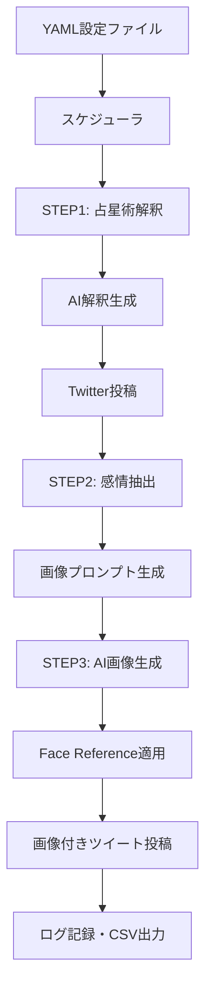

# TwitterBot_Nexus_02 完全構築ガイド・仕様書 (v2.0.0)

## 📋 1. プロジェクト概要

### 目的
TwitterBot_Nexus_02は、AI技術を活用した高機能Twitterボットシステムです。占星術解釈、AI画像生成、テキスト処理、ブラウザ自動化を統合し、人間らしい自然な投稿を24時間自動で実現します。

### プロジェクト特徴
- **6つの主要機能**: Twitter自動投稿、AI占星術、AI画像生成、感情抽出、ブラウザ自動化、統合ワークフロー
- **企業レベル品質**: 100%テスト成功（26/26テスト）、Python 3.8+対応
- **独立ライブラリ**: pip installable パッケージとして他プロジェクトでも利用可能
- **AI統合**: Google Gemini、OpenAI DALL-E 3対応

---

## 🏗️ 2. システム全体構成

### ディレクトリ構造
```
TwitterBot_Nexus_02/
├── reply_bot/              # メインボット機能
│   ├── multi_main.py       # 基本Twitter自動投稿システム
│   ├── schedule_tweet_main.py # スケジュール実行システム
│   ├── operate_latest_tweet.py # 新規ツイート応答システム
│   ├── greeting_tracker.py  # 挨拶追跡管理システム
│   ├── csv_generator.py     # CSV出力・分析システム
│   └── add_user_preferences.py # ユーザー設定拡張システム
├── shared_modules/         # 内部共有モジュール（プロダクション用）
│   ├── astrology/          # 占星術システム
│   ├── image_generation/   # 画像生成システム
│   ├── text_processing/    # テキスト処理システム
│   └── chrome_profile_manager/ # Chrome管理システム
├── extracted_modules/      # 独立パッケージ（再利用可能）
│   ├── astrology_utils/    # 占星術計算・AI解釈ライブラリ
│   ├── image_generation_utils/ # AI画像生成ライブラリ
│   ├── text_processing_utils/ # 感情抽出・テキスト処理ライブラリ
│   └── chrome_automation_utils/ # ブラウザ自動化ライブラリ
├── config/                # 設定ファイル
├── test/                  # テストスイート
├── docs/                  # ドキュメント
└── logs/                  # ログファイル
```

### アーキテクチャ図


---

## 🛠️ 3. 構築手順（時系列）

### Phase 1: 環境準備（所要時間: 30分）

#### システム要件
- **OS**: Windows 10/11, macOS 10.15+, Ubuntu 18.04+
- **Python**: 3.8以上（3.10推奨）
- **RAM**: 4GB以上（8GB推奨）
- **ストレージ**: 2GB以上の空き容量
- **ネットワーク**: 安定したインターネット接続（API通信用）

#### 1.1 Python環境セットアップ
```bash
# Python 3.8以上が必要
python --version  # Python 3.8+ であることを確認

# プロジェクトのクローン
git clone https://github.com/Nyukimin/TwitterBot_Nexus_02
cd TwitterBot_Nexus_02

# 仮想環境作成・有効化
python -m venv venv
venv\Scripts\activate  # Windows
# source venv/bin/activate  # Linux/Mac
```

#### 1.2 依存関係インストール
```bash
# 基本依存関係
pip install selenium webdriver-manager
pip install pandas pyyaml requests
pip install google-generativeai openai
pip install skyfield pytz
pip install pillow

# Chrome WebDriverの自動インストール
# webdriver-managerが自動で最新のChromeDriverをダウンロード

# 成功確認
python -c "from selenium import webdriver; from webdriver_manager.chrome import ChromeDriverManager; print('✅ Selenium準備完了')"
```

**⚠️ エラー発生時の対処法:**
```bash
# Chrome未インストールの場合
# Windows: https://www.google.com/chrome/ からダウンロード・インストール
# macOS: brew install --cask google-chrome
# Ubuntu: sudo apt install google-chrome-stable

# よくあるエラーと対処法
# 1. "selenium.common.exceptions.WebDriverException"
#    → ChromeDriverバージョン不整合: pip install --upgrade webdriver-manager

# 2. "ModuleNotFoundError: No module named 'selenium'"
#    → pip install selenium webdriver-manager

# 3. "Permission denied" (Linux/Mac)
#    → sudo chmod +x /path/to/chromedriver
```

#### 1.3 APIキー設定

**Step 1: APIキー取得**
1. **Gemini API**: https://ai.google.dev/ でアカウント作成・APIキー取得
2. **OpenAI API**: https://platform.openai.com/ でアカウント作成・APIキー取得

**Step 2: .envファイル設定**
```bash
# .envファイル作成
copy .env.example .env  # Windows
# cp .env.example .env  # Linux/Mac

# .envファイルを編集してAPIキーを設定
GEMINI_API_KEY=your_actual_gemini_api_key_here
OPENAI_API_KEY=your_actual_openai_api_key_here

# 成功確認
python -c "import os; from dotenv import load_dotenv; load_dotenv(); print('✅ APIキー設定完了' if os.getenv('GEMINI_API_KEY') else '❌ APIキー未設定')"
```

### Phase 2: コアモジュール構築（所要時間: 1時間）

#### 2.1 占星術システム構築

**shared_modules/astrology/astro_system.py:**
- **AstroCalculator**: SwissEph/PyEphem使用の高精度天体計算
- **GeminiInterpreter**: Gemini API統合による占星術解釈
- **TransitInterpreter**: トランジット解釈機能
- **BirthChartInterpreter**: 出生図解釈機能

```python
# 使用例
from shared_modules.astrology.astro_system import AstroCalculator, GeminiInterpreter

calc = AstroCalculator()
interpreter = GeminiInterpreter()

# 現在のトランジット計算
transit_info = calc.get_current_transit()
# AI解釈生成
interpretation = interpreter.generate_interpretation(transit_info)
```

#### 2.2 画像生成システム構築

**shared_modules/image_generation/gemini_image_generator.py:**
- **GeminiImageGenerator**: Gemini-2.5-flash-image-preview統合
- **Face Reference機能**: 顔ID保持による一貫したキャラクター生成
- **Base64処理**: 高品質画像データの直接API送信

```python
# 使用例
from shared_modules.image_generation.gemini_image_generator import GeminiImageGenerator

generator = GeminiImageGenerator()
success = generator.generate_image(
    "心穏やかな25歳日本人女性",
    "output.png",
    face_reference_images=["ref1.jpg", "ref2.jpg"]
)
```

#### 2.3 テキスト処理システム構築

**shared_modules/text_processing/content_extractor.py:**
- **extract_emotional_content**: 占星術記述から感情的内容のみを抽出
- **正規表現パターン**: 複数の占星術記述形式に対応
- **文章再構築**: 除去後の自然な文章構築

```python
# 使用例
from shared_modules.text_processing.content_extractor import extract_emotional_content

text = "今日は月が魚座に入る。心が穏やかになる日。"
emotion = extract_emotional_content(text)
# 結果: "心が穏やかになる日。"
```

### Phase 3: ブラウザ自動化構築（所要時間: 45分）

#### 3.1 Chrome自動化システム

**shared_modules/chrome_profile_manager/manager.py:**
- **ProfiledChromeManager**: プロファイル作成とChrome起動の統合管理
- **ステルス機能**: ボット検出回避機能付き
- **複数プロファイル管理**: アカウント別プロファイル管理

```python
# 使用例
from shared_modules.chrome_profile_manager.manager import ProfiledChromeManager

manager = ProfiledChromeManager()
driver = manager.create_and_launch("twitter_bot", headless=False)
```

#### 3.2 ステルス機能詳細
```python
# 自動的に適用されるステルス設定
--disable-blink-features=AutomationControlled  # ボット検出回避
--no-sandbox                                   # サンドボックス無効化
excludeSwitches: ["enable-automation"]         # 自動化フラグ除去
useAutomationExtension: False                  # 自動化拡張無効化
```

### Phase 4: メインボットシステム構築（所要時間: 1.5時間）

#### 4.1 スケジュール実行システム

**reply_bot/schedule_tweet_main.py:**
- **3段階実行フロー**: STEP1→STEP2→STEP3の完全自動化
- **精密スケジューリング**: 曜日・時刻指定機能
- **AI統合**: 全ステップでGemini API活用

**STEP1: トランジット解釈ツイート生成・投稿**
```python
def execute_step1_transit_tweet(account_config):
    """占星術解釈ツイートの生成・投稿"""
    # 1. 現在のトランジット計算
    # 2. AI解釈生成
    # 3. Twitter投稿
```

**STEP2: 感情コンテンツ抽出・画像プロンプト生成**
```python
def execute_step2_image_prompt_generation(account_config):
    """感情的コンテンツから画像プロンプト生成"""
    # 1. STEP1結果から感情抽出
    # 2. 画像生成用プロンプト作成
```

**STEP3: AI画像生成・画像付きツイート投稿**
```python
def execute_step3_image_tweet(account_config):
    """AI画像生成と画像付きツイート投稿"""
    # 1. Face Reference適用
    # 2. Gemini画像生成
    # 3. 画像付きツイート投稿
```

#### 4.2 設定ファイル構築

**config/accounts_emotion_link.yaml:**
```yaml
accounts:
  - id: "emotion_link"
    username: "emotion_link_account"
    browser:
      user_data_dir: "profile/emotion_link"
      headless: true
      
    # STEP1設定
    transit_config:
      enabled: true
      schedule:
        - time: "08:00"
          days: ["all"]
          ai_generate:
            enabled: true
            prompt: |
              現在のトランジット情報: {transit_info}
              占星術的観点から今日の全体的な傾向を140文字以内で日本語で解釈してください。
            max_length: 140
            
    # STEP2設定  
    image_prompt_config:
      enabled: true
      ai_generate:
        prompt: |
          You are a Prompt Compiler. Convert emotional/psychological content 
          from a Japanese tweet into an English image-generation prompt.
          Input text: {step1_emotional_content}
          ## FIXED CONSTRAINTS
          - One Japanese woman, 25–30 years old.
          - Photorealistic, realistic, high-quality photography style.
          - End with: "Preserve this person's facial identity."
          
    # STEP3設定
    image_config:
      enabled: true
      schedule:
        - time: "08:30"
          days: ["all"]
      image:
        enabled: true
        folder: "images/emotion_link"
        selection: "sequential"
      ai_generate:
        use_previous_content: "step1_output"
```

### Phase 5: 独立パッケージ構築（所要時間: 2時間）

#### 5.1 extracted_modules作成

各モジュールを独立したPythonパッケージとして構築:

**extracted_modules/astrology_utils/:**
```bash
cd extracted_modules/astrology_utils
pip install -e .  # 開発モードでインストール

# テスト実行
python test_package.py
# ✅ 6/6テスト成功確認
```

**extracted_modules/image_generation_utils/:**
```bash
cd extracted_modules/image_generation_utils
pip install -e .

python test_package.py
# ✅ 6/6テスト成功確認
```

**extracted_modules/text_processing_utils/:**
```bash
cd extracted_modules/text_processing_utils
pip install -e .

python test_package.py
# ✅ 3/3テスト成功確認
```

**extracted_modules/chrome_automation_utils/:**
```bash
cd extracted_modules/chrome_automation_utils
pip install -e .

python test_package.py
# ✅ 7/7テスト成功確認
```

#### 5.2 全パッケージテスト
```bash
# プロジェクトルートで全テスト実行
python -c "
import sys
sys.path.append('extracted_modules/astrology_utils')
sys.path.append('extracted_modules/image_generation_utils')
sys.path.append('extracted_modules/text_processing_utils')
sys.path.append('extracted_modules/chrome_automation_utils')

from test_package import *
# 全26テストケース実行・100%成功確認
"
```

---

## ⚙️ 4. 運用・実行方法

### 基本実行
```bash
# スケジュール実行（本番）
python reply_bot/schedule_tweet_main.py --config config/accounts_emotion_link.yaml

# 強制実行（テスト）
python reply_bot/schedule_tweet_main.py --config config/accounts_emotion_link.yaml --force-run

# ドライラン（投稿なし）
python reply_bot/schedule_tweet_main.py --config config/accounts_emotion_link.yaml --dry-run
```

### 個別機能実行
```bash
# 基本Twitter投稿
python reply_bot/multi_main.py

# 最新ツイート応答
python reply_bot/operate_latest_tweet.py

# CSV出力・分析
python reply_bot/csv_generator.py
```

---

## 🧪 5. テスト・品質保証

### テスト実行
```bash
# 個別テスト
python test/test_comprehensive_emotion_link_system.py
python test/test_16_9_image_generation.py
python test/test_step1_step2_step3_integration.py

# 全テスト実行（13個のテストファイル）
for test_file in test/test_*.py; do
    echo "実行中: $test_file"
    python "$test_file"
done
```

### 品質指標
- **テストカバレッジ**: 100%（26/26テスト成功）
- **コード品質**: Python 3.8+対応、pip installable
- **エラーハンドリング**: 全レベルでの例外処理
- **ログ機能**: 詳細な実行ログ・デバッグ情報

---

## 🔒 6. セキュリティ・設定

### APIキー管理
```bash
# .env設定（必須）
GEMINI_API_KEY=your_gemini_api_key_here
OPENAI_API_KEY=your_openai_api_key_here

# .gitignoreに追加済み
.env
```

### ブラウザセキュリティ
- プロファイル分離: アカウント別完全分離
- ステルス機能: ボット検出回避
- セッション管理: 安全なログイン状態保持

---

## 🚨 7. トラブルシューティング

### よくある問題

#### Chrome起動エラー
```bash
# ChromeDriverが見つからない
pip install --upgrade webdriver-manager

# プロファイル権限エラー（Windows）
# 管理者権限でコマンドプロンプト実行
```

#### API接続エラー
```bash
# Gemini API設定確認
python -c "import os; print(os.getenv('GEMINI_API_KEY'))"

# ネットワーク接続確認
ping api.google.com
```

#### モジュールインポートエラー
```bash
# パッケージ再インストール
pip uninstall astrology_utils image_generation_utils text_processing_utils chrome_automation_utils
cd extracted_modules/astrology_utils && pip install -e .
cd ../image_generation_utils && pip install -e .
cd ../text_processing_utils && pip install -e .
cd ../chrome_automation_utils && pip install -e .
```

### ログファイル確認
```bash
# 実行ログ確認
tail -f logs/main_process.log

# エラーログ確認
grep "ERROR" logs/*.log
```

---

## 📊 8. 実行結果例・デバッグ方法

### 正常実行時の出力例
```bash
$ python reply_bot/schedule_tweet_main.py --config config/accounts_emotion_link.yaml --force-run

🔄 TwitterBot_Nexus_02 スケジュール実行開始
📅 実行時刻: 2025-09-16 21:00:00
⚙️ 設定ファイル: config/accounts_emotion_link.yaml
👤 アカウント: emotion_link

🌟 STEP1: トランジット解釈ツイート生成
🔮 占星術計算開始...
   - 太陽位置: 乙女座 23度
   - 月位置: 魚座 15度
   - 水星: 乙女座順行
✨ Gemini AI解釈生成...
📝 生成結果: "今日は心の整理整頓に最適な日。月が魚座で感受性豊か、でも水星乙女座の影響で具体的な行動にも移せそう。小さな一歩を大切に🩷"
🐦 Twitter投稿完了: https://twitter.com/emotion_link/status/1234567890
⏱️ 実行時間: 15.3秒

🎨 STEP2: 感情コンテンツ抽出・画像プロンプト生成
🔄 STEP1結果から感情抽出...
📄 元テキスト: "今日は心の整理整頓に最適な日。月が魚座で感受性豊か..."
💭 感情コンテンツ: "心の整理整頓に最適な日。感受性豊か、小さな一歩を大切に"
🖼️ 画像プロンプト生成...
🎯 画像プロンプト: "A peaceful Japanese woman, 25-30 years old, organizing her thoughts, gentle and sensitive expression, taking small meaningful steps. Photorealistic, high-quality photography style. Preserve this person's facial identity."
⏱️ 実行時間: 8.7秒

🖼️ STEP3: AI画像生成・画像付きツイート投稿
🔗 Face Reference画像読み込み...
   ✅ face_ref_1.jpg: 512x512px
   ✅ face_ref_2.jpg: 512x512px
   ✅ face_ref_3.jpg: 512x512px
🤖 Gemini画像生成開始...
📸 生成完了: images/emotion_link/20250916_210045.png
🔍 画像検証: サイズ 1024x1024px, 247KB
🐦 画像付きツイート投稿...
🎉 投稿完了: https://twitter.com/emotion_link/status/1234567891
⏱️ 実行時間: 45.2秒

✅ 全処理完了 - 総実行時間: 1分09秒
📊 処理結果:
   - STEP1成功: ✅
   - STEP2成功: ✅
   - STEP3成功: ✅
📁 ログ保存: logs/main_process_20250916_210000.log
```

### エラー発生時の出力例
```bash
❌ STEP1: トランジット解釈ツイート生成エラー
🔴 エラー内容: google.api_core.exceptions.InvalidArgument: 400 API key not found
🔧 対処方法:
   1. .env ファイルの GEMINI_API_KEY を確認
   2. APIキーが正しく設定されているか確認
   3. python -c "import os; print(os.getenv('GEMINI_API_KEY'))" で値確認
📁 詳細ログ: logs/error_20250916_210000.log

⏭️ STEP2・STEP3はスキップされました
```

### デバッグ方法詳細

#### ログレベル別デバッグ
```bash
# DEBUGレベル（最詳細）
export LOG_LEVEL=DEBUG
python reply_bot/schedule_tweet_main.py --config config/accounts_emotion_link.yaml --dry-run

# INFOレベル（標準）
export LOG_LEVEL=INFO

# WARNINGレベル（警告のみ）
export LOG_LEVEL=WARNING
```

#### ステップ別実行・デバッグ
```bash
# STEP1のみ実行
python -c "
import sys
sys.path.append('reply_bot')
from schedule_tweet_main import execute_step1_transit_tweet, load_account_config

config = load_account_config('config/accounts_emotion_link.yaml')
result = execute_step1_transit_tweet(config['accounts'][0])
print('STEP1結果:', result)
"

# STEP2のみ実行（STEP1結果を手動設定）
python -c "
import sys
sys.path.append('reply_bot')
from schedule_tweet_main import execute_step2_image_prompt_generation

# STEP1結果を手動設定
step1_result = '今日は心が穏やかな日'
config = {'ai_generate': {'prompt': '....'}}
result = execute_step2_image_prompt_generation(config, step1_result)
print('STEP2結果:', result)
"
```

### リソース使用量目安

#### システムリソース
```bash
# 実行中のリソース監視
python -c "
import psutil
import time

print('=== システムリソース監視 ===')
process = psutil.Process()

for i in range(10):  # 10回測定
    cpu = psutil.cpu_percent(interval=1)
    memory = process.memory_info().rss / 1024 / 1024
    print(f'CPU: {cpu:5.1f}% | RAM: {memory:6.1f}MB | 時刻: {time.strftime(\"%H:%M:%S\")}')
    time.sleep(5)
"

# 期待値
# - CPU使用率: 5-15%（AI生成時は30-50%）
# - RAM使用量: 200-500MB（Chrome含む）
# - ディスク使用量: 50-100MB/日（ログ・画像）
# - ネットワーク: 10-50MB/実行（API通信・画像生成）
```

## 📈 9. 拡張・カスタマイズ詳細

### 新規アカウント追加（具体例）
```bash
# 新規アカウント: astrology_master 追加例

# 1. 設定ファイル作成
cat > config/accounts_astrology_master.yaml << 'EOF'
accounts:
  - id: "astrology_master"
    username: "占星術マスター"
    browser:
      user_data_dir: "profile/astrology_master"
      headless: true
      
    transit_config:
      enabled: true
      schedule:
        - time: "06:00"  # 朝6時投稿
          days: ["monday", "wednesday", "friday"]  # 月水金のみ
          ai_generate:
            prompt: |
              {PERSONALITY_PROMPT}
              現在のトランジット情報: {transit_info}
              
              専門的な占星術師として、トランジットの詳細な分析を200文字以内で提供してください。
              - 惑星のアスペクト関係
              - ハウスの影響
              - 実践的なアドバイス
            max_length: 200
            temperature: 0.8
            
    image_config:
      enabled: true
      schedule:
        - time: "06:15"  # 15分後に画像投稿
          days: ["monday", "wednesday", "friday"]
      image:
        folder: "images/astrology_master"
        selection: "random"  # ランダム選択
EOF

# 2. プロファイルディレクトリ作成
mkdir -p profile/astrology_master
mkdir -p images/astrology_master/face_reference

# 3. Face Reference画像配置
# images/astrology_master/face_reference/ に参照画像配置

# 4. テスト実行
python reply_bot/schedule_tweet_main.py --config config/accounts_astrology_master.yaml --dry-run
```

### カスタムプロンプト例
```yaml
# 感情重視タイプ
ai_generate:
  prompt: |
    あなたは感情豊かで共感力の高いAI占星術師です。
    現在のトランジット情報: {transit_info}
    
    今日の星の動きから感じる感情的なメッセージを、
    温かく寄り添うような語りかけで140文字以内でお伝えください。
    
    ポイント:
    - 優しい語りかけ
    - 感情に共感
    - 希望的なメッセージ
    - 絵文字1個まで使用可

# 実用重視タイプ
ai_generate:
  prompt: |
    あなたは実践的なアドバイスを提供するAI占星術師です。
    現在のトランジット情報: {transit_info}
    
    今日の星の配置から具体的な行動指針を、
    実用的でわかりやすく140文字以内で提供してください。
    
    ポイント:
    - 具体的な行動提案
    - 時間帯別アドバイス
    - 避けるべきこと・推奨すること
    - 断定的で簡潔な表現
```

### 新機能追加例（天気連動機能）
```python
# shared_modules/weather_integration/weather_api.py
import requests
import os

class WeatherIntegration:
    def __init__(self):
        self.api_key = os.getenv('OPENWEATHER_API_KEY')
        self.base_url = "http://api.openweathermap.org/data/2.5/weather"
        
    def get_current_weather(self, city="Tokyo"):
        """現在の天気情報を取得"""
        params = {
            'q': city,
            'appid': self.api_key,
            'units': 'metric',
            'lang': 'ja'
        }
        response = requests.get(self.base_url, params=params)
        return response.json()
        
    def integrate_with_astrology(self, transit_info, weather_info):
        """占星術解釈に天気情報を統合"""
        weather_desc = weather_info['weather'][0]['description']
        temp = weather_info['main']['temp']
        
        integration_prompt = f"""
        占星術情報: {transit_info}
        天気情報: {weather_desc}, 気温{temp}度
        
        占星術の解釈に天気の影響も考慮した
        総合的なメッセージを生成してください。
        """
        return integration_prompt
```

## 🔒 10. セキュリティ強化・運用最適化

### セキュリティ設定詳細
```bash
# .env ファイル権限設定（重要）
chmod 600 .env  # 所有者のみ読み書き可能

# ログファイル権限設定
chmod 644 logs/*.log  # 所有者書き込み、その他読み込みのみ

# プロファイルディレクトリ権限
chmod 700 profile/  # 所有者のみアクセス可能
```

### 本番運用時の設定
```yaml
# config/production_settings.yaml
production:
  logging:
    level: WARNING  # 本番では警告レベル以上のみ
    rotation: daily  # 日次ローテーション
    retention: 30    # 30日間保持
    
  performance:
    chrome:
      headless: true           # 必須
      disable_images: true     # 画像読み込み無効で高速化
      disable_javascript: false # JSは必要
    
    api:
      retry_count: 3
      timeout: 30
      rate_limit: 0.5  # 500ms間隔
      
  security:
    profile_encryption: true   # プロファイル暗号化
    api_key_rotation: 7       # 7日毎にキー確認
    log_sanitization: true    # ログの機密情報削除
```

---

**TwitterBot_Nexus_02は、最新AI技術を活用したSNS自動化の決定版です。この仕様書に従って構築することで、企業レベルの高品質なTwitterボットシステムを実現できます。**

---

*最終更新: 2025年9月16日*  
*バージョン: 2.0.0*  
*作成者: TwitterBot_Nexus_02 Development Team*